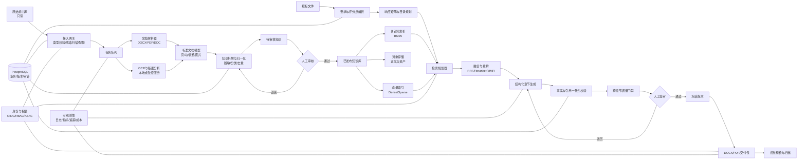
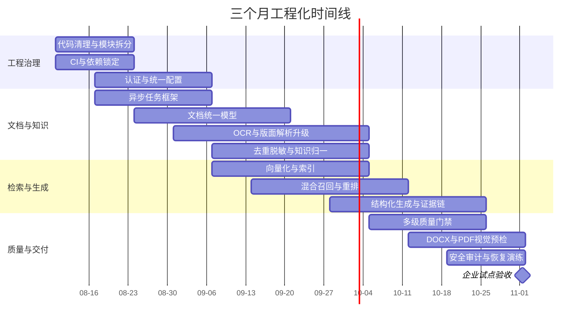

# bid-writer 工程化技术评估与改造方案

## 执行摘要

该项目已形成“原始资料—知识加工—审核发布—检索生成—质量门禁—DOCX交付”的完整本地 MVP，知识发布边界与证据追溯方向正确；但当前检索仍以 FTS5/LIKE 为主，解析、异步任务、质量校验、权限隔离和可扩展部署尚未达到企业生产或多租户 SaaS 标准。建议优先建设企业私有化单租户版本，再演进为 SaaS。fileciteturn1file0L2-L2

## 审查范围与总体定位

**审查基准日期：2026 年 8 月 6 日。**

本次评估以仓库当前 `main` 分支为准，重点审查了：

| 范围 | 已审查内容 |
|---|---|
| 项目边界 | `README.md`、数据目录和发布边界 |
| 后端入口 | `backend/bid_writer_v2/app.py` |
| 知识工程 | `knowledge/service.py`、`parsers.py`、`ocr.py`、`api.py` |
| 生产系统 | `production/service.py`、`production/api.py` |
| 数据模型 | `migrations/001_initial.sql` |
| 模型接入 | `llm.py` |
| 配置 | `settings.py` |
| 前端 | `frontend/package.json` 及主要页面、API 调用结构 |
| 测试 | `backend/tests_v2/test_v2_workflow.py` |
| 依赖 | `backend/requirements.txt`、`frontend/package.json` |

仍需继续逐文件审查的路径包括：`backend/bid_writer_v2/database.py`、`utils.py`、全部后续 migration、`frontend/src/pages/*` 的完整交互逻辑、`run_server.cmd`、`backend/scripts_v2/*`、静态资源处理、全部 `docs/*`、错误日志与备份脚本。以下涉及这些内容的判断均标注为“仓库未明确/需代码审查”。

### 总体定位判断

项目 README 将系统定义为“技术标生产与知识工程系统”，明确以 `02_知识库` 为知识资产中心，以 `backend/bid_writer_v2/knowledge` 承担扫描、去重、解析、OCR、拆解、重构、审核、发布和检索，以 `production` 承担项目、要求、目录、章节生成、证据响应、质量门禁和 DOCX 导出。这个定位并不是普通“AI 写作工具”，而是面向工程投标业务的知识生产与受控文档生成系统。**该定位与工程行业真实需求匹配度较高。**fileciteturn1file0L2-L2

项目当前最有价值的架构决定是：

> **未经审核的历史资料不能直接进入正式生成，生成只能检索已发布知识。**

代码中已经存在知识版本、审核、发布、停用和恢复流程；发布时写入内容哈希，并仅把当前发布版本写入 `published_units_fts`。这比“所有历史标书直接向量化后交给大模型”更适合工程投标场景，因为旧标书中常含旧项目名称、过期承诺、错误参数和特定客户信息。fileciteturn9file0L2-L2

当前形态更准确的定位是：

| 目标形态 | 当前匹配度 | 判断 |
|---|---:|---|
| 个人或小团队本地工作台 | 高 | 已具备可运行主流程 |
| 企业内部单租户系统 | 中 | 需补权限、任务队列、审计、备份和检索升级 |
| 企业私有化产品 | 中低 | 需完成容器化、数据库升级、对象存储、SSO 和运维体系 |
| 公有多租户 SaaS | 低 | 当前缺少租户模型、身份认证、资源配额、数据隔离和高可用架构 |

### 已经形成的工程基础

仓库中已经发现以下可保留资产：

- 原始资料、运行索引、发布知识和正式交付之间的目录边界。
- 源文件 SHA-256、文档内容指纹和知识版本内容哈希。
- `source → document → section → knowledge unit → version → publication` 的基本数据链。
- 审核后发布、发布后检索、停用后撤出检索的闭环。
- 项目、招标要求、目录章节、章节草稿、响应证据和交付记录的数据结构。
- FastAPI 与 React/Vite 的前后端分层。
- DOCX 原生标题、表格、图片和页码生成。
- 基本端到端测试，覆盖“未审核知识不可检索”“发布后可生成”“质量门禁后导出”等核心边界。fileciteturn17file0L2-L2 fileciteturn20file0L2-L2

### 当前最关键的技术结论

**第一，知识治理框架优于当前 RAG 技术实现。** 数据模型已考虑来源、版本、审核和发布，但实际检索仍是 SQLite FTS5/BM25 加 LIKE 回退，没有 embedding、向量索引、混合召回、交叉编码器重排或检索评测集。fileciteturn9file0L2-L2

**第二，当前生产逻辑仍是规则型 MVP。** 招标要求通过逐行关键词筛选，目录固定为十一章，再按关键词把要求挂接到章节；这适合打通流程，不足以稳定解析复杂评分办法、否决项、表格、附件和跨页条款。fileciteturn10file0L2-L2

**第三，质量门禁已有雏形，但还不能被视为“总工签审”。** 当前能检查缺章、待确认项、占位符、失效引用和覆盖率；然而模型只要返回非空 evidence，就会被赋值 `coverage_score=1.0`，且质量统计没有过滤已被标记为 `invalidated` 的响应证据。人工确认操作也只是清空待确认数组并设置状态，没有绑定内容哈希、身份和签审意见。fileciteturn21file0L2-L2

**第四，当前不宜直接暴露到互联网。** 已审查的知识和项目 API 没有看到认证、角色、项目权限或租户过滤；审核人与发布人由请求正文直接传入字符串。全局异常处理还会把异常类型和异常文本返回给客户端。OWASP API Security Top 10 将对象级授权、身份认证、功能级授权和不受限制的资源消耗列为核心 API 风险。fileciteturn18file0L2-L2 fileciteturn19file0L2-L2 fileciteturn24file0L2-L2 citeturn8search3turn8search6

## 端到端模块评估

以下完成度为“距离可控企业生产基线”的评估值，而不是代码行完成比例。人日估算假设复用现有代码，不包括大规模历史标书人工标注和行业专家全职投入。

| 工作流模块 | 当前完成度与仓库证据 | 关键风险 | 核心改进建议 | 优先级 | 估算人日 |
|---|---|---|---|---|---:|
| 知识采集 | **约 70%**。已支持递归扫描、SHA-256、状态登记、ZIP/RAR/7Z 识别、压缩包成员登记、重复文件识别、来源清单输出；ZIP 解压有基本路径穿越检查，并处理旧中文 ZIP 文件名。fileciteturn6file0L2-L2 | 缺少 MIME/魔数校验、压缩炸弹限制、病毒扫描、文件大小与页数配额；7Z 外部进程隔离不足；扫描状态与真实文件变更的一致性需验证 | 增加文件接入网关、类型白名单、ClamAV、压缩比和展开总量限制；建立 source revision 而不是直接覆盖同一路径记录；采集过程写审计事件 | 高 | 15–25 |
| 解析与 OCR | **约 55%**。DOCX 解析段落、标题和表格，PDF 使用 `pypdf`，低文本量触发 OCR；DOC 可由 LibreOffice 或 Word COM 转换；OCR 按 100 页切片并缓存结果。fileciteturn13file0L2-L2 fileciteturn14file0L2-L2 | DOCX 图片被批量抽取但不保留精确锚点；自定义中文标题样式可能漏识别；PDF 表格、双栏、页眉页脚和跨页结构易失真；OCR 调用同步轮询最长可达约一小时；文件被发送到外部 OCR 服务，涉及客户资料外传风险 | 引入 Docling 或 PaddleOCR PP-Structure/VL 作为结构解析层；保留页面、坐标、块类型、表格单元格和图片关系；OCR 改为队列任务，支持取消、重试、超时和本地部署；设置 OCR 置信度与人工抽检 | 高 | 30–45 |
| 知识拆解与归一化 | **约 50%**。按 Markdown 标题和页码注释拆分 section，短片段过滤，按规则分类为施工工艺、质量、安全、进度等知识类型；使用正则替换项目名和电话。fileciteturn7file0L2-L2 fileciteturn8file0L2-L2 | 拆分高度依赖标题质量；项目脱敏只有少量正则；地点、公司、人员、金额、设备数量、日期和业绩信息仍可能残留；知识分类与聚类主要依赖标题关键词，不是真正语义归一 | 建立 block/section/unit 三层模型；增加 NER 与规则组合脱敏；对单位、数量、日期和承诺建立“事实类型”；引入语义近重复聚类和人工合并；区分事实知识、方法知识、模板知识和证据资产 | 高 | 30–45 |
| 知识库建模与索引 | **约 55%**。已有来源、文档、章节、知识单元、版本、审核、发布、资产及 FTS 索引；发布记录含版本、发布人、文件路径和内容哈希。fileciteturn17file0L2-L2 | 无 tenant、organization、ACL、保密级别、有效期和法规版本；无 embedding 及 embedding model/version；SQLite 是单机运行索引；中文 `unicode61` 检索效果需专项基准验证 | 保留当前治理表，新增 tenant、ACL、classification、valid_from/to、embedding_version、chunk lineage；生产环境迁移 PostgreSQL，加 Qdrant/Weaviate；文件正文进入对象存储 | 高 | 35–50 |
| 检索策略 | **约 35%**。只检索当前 published 版本，使用 FTS5 `bm25` 和 LIKE 回退，可按行业和知识类型过滤并返回来源。fileciteturn9file0L2-L2 | 语义召回不足；长查询被简单抽取词组；无 query rewrite、dense retrieval、RRF、reranker、MMR、父子文档召回和来源多样性控制；未建立 Recall@K 基准 | 建立 BM25/稀疏 + dense 向量双路召回；RRF 融合；BGE reranker 重排；按租户、行业、项目类型、状态、有效期和风险级别预过滤；建立金标准查询集 | 高 | 25–40 |
| 生成与章节合成 | **约 45%**。章节生成使用项目事实、条款和最多八条已发布知识，要求模型输出 JSON，并保存知识发布版本、内容哈希和来源；模型不可用时提供本地回退草稿。fileciteturn10file0L2-L2 | 当前是单次生成，不是可验证的“初稿—复核—重写”；引用停留在整个知识单元层面；无严格 JSON Schema；上下文按字符截断；回退方案可能大段拼接历史知识；`production/service.py` 尾部存在重复方法定义，后定义覆盖前定义，属于高风险合并遗留 | 拆分需求规划、检索、起草、事实核验、风格重写五阶段；使用结构化响应 Schema；建立 claim-level citation；去除重复定义并拆分 service；生成运行记录固化 prompt、模型、参数、上下文和输出哈希 | 高 | 35–50 |
| 质量控制与审校 | **约 40%**。已检查缺章、待确认、占位符、失效发布引用和条款覆盖率，并阻止未通过项目导出。fileciteturn21file0L2-L2 | 覆盖率可被非空模型文本“虚高”；已失效的 requirement response 仍可能计入覆盖；未验证引用内容是否真的支持正文；无跨章节矛盾、数值一致性、旧项目残留、禁止承诺、规范有效性和内部查重 | 建立确定性检查、语义支持检查、跨章一致性检查和人工签审四级门禁；编辑后按内容哈希自动使签审失效；覆盖率只统计已确认且能定位原文的 evidence span | 最高 | 40–60 |
| 交付与导出 | **约 50%**。支持 Markdown、DOCX、标题、目录域、页脚页码、图片和原生表格；质量门禁未通过时禁止导出。fileciteturn11file0L2-L2 | 当前 V2 代码未看到正式 PDF 渲染预检、OOXML 审计、空白页/越界检测、不可变交付包和数字签名；图片路径依赖本地文件；目录域需 Word 更新 | 引入模板化 DOCX 渲染、PDF 转换与逐页视觉检查；输出 manifest、文件哈希、质量报告、引用清单和签审记录；交付包冻结并生成不可变 artifact ID | 中高 | 25–40 |
| 运维、权限与可观测性 | **约 15%**。当前定位为本地运行，配置主要来自环境变量和本地目录。fileciteturn15file0L2-L2 | 无认证/RBAC/租户；同步 OCR 和批量任务可能阻塞 Web 进程；SQLite 并发和高可用有限；无明确 CI/CD、容器编排、限流、调用成本、指标、分布式追踪和灾备；异常详情暴露 | 增加 OIDC/SSO、RBAC/ABAC、租户上下文、异步 worker、PostgreSQL、对象存储、审计日志、OpenTelemetry、Prometheus、Docker、CI/CD 和备份恢复演练 | 最高 | 50–75 |

**企业生产基线总改造量：约 285–430 人日。** 其中前三个月应聚焦约 240–300 人日的高优先级范围，而不是同时完成全部 SaaS 能力。

### 必须立即处理的代码级问题

| 问题 | 影响 | 处理方式 |
|---|---|---|
| `production/service.py` 出现重复的 `parse_requirements`、`build_outline`、`_fallback_section` 定义 | 后定义静默覆盖前定义，后续维护者难以判断真实执行逻辑 | 第一周完成 service 拆分和重复代码清理，增加静态检查 |
| `quality_gate` 未过滤 `requirement_responses.review_status` | 修改草稿后，旧 evidence 被标记 invalidated，但仍可能计入覆盖率 | SQL 强制 `review_status='confirmed'`，并校验 draft/content fingerprint |
| `confirm_draft` 直接清空 confirmations | 人工确认没有逐项结论，也没有绑定签审人身份和内容版本 | 新建 review_decision 与 confirmation_resolution 表，不修改原始问题记录 |
| 审核人、发布人由客户端传字符串 | 无法证明真实操作者身份 | 由认证 token 注入 `actor_id`，客户端不得指定身份 |
| OCR URL、模型和 token 命名未统一进入 Settings | 配置漂移和部署失败风险 | 建立强类型配置，启动时执行配置校验 |
| 后端依赖以 `>=` 为主，前端没有测试脚本 | 构建不可完全复现，回归保护不足 | 使用 lock 文件、版本范围策略、依赖更新机器人和 CI |
| 全局异常返回异常文本 | 可能泄露路径、SQL、内部服务信息 | 客户端返回稳定错误码，详细堆栈只写服务端受控日志 |

后端目前仅列出 FastAPI、Uvicorn、python-docx、pypdf、requests、httpx 等基础依赖，尚未引入任务队列、向量数据库客户端、身份认证、可观测性或结构化文档解析框架。前端使用 React 19、Vite 7 和 JavaScript，未看到 TypeScript、测试框架或 API Schema 生成工具。fileciteturn23file0L2-L2 fileciteturn22file0L2-L2

## 目标架构与知识库方案

### 推荐系统模块关系



这套架构继续保留仓库现有的“已发布知识是唯一正式检索边界”，但把文档处理、知识治理、检索、生成和签审拆成可单独测试、扩容和审计的组件。RAG 的原始思想就是将模型参数化知识与外部非参数知识结合，同时允许追溯和更新外部知识；项目现有发布机制正适合作为这一外部知识层的治理基础。citeturn2academia36

### 推荐数据模型

当前数据库骨架可以保留，但建议升级为以下核心实体。正文大对象放对象存储，数据库保存结构、状态、哈希和定位信息。

| 实体 | 关键属性示例 | 作用 |
|---|---|---|
| `Tenant` / `Organization` | `tenant_id`、名称、数据区域、KMS key、保留策略 | 租户隔离和企业策略根 |
| `SourceDocument` | 来源、客户、保密级别、文件类型、原始哈希、ACL、接入人 | 原始文件逻辑身份 |
| `SourceRevision` | revision、object_uri、sha256、size、mime、virus_status、created_at | 同一文件不同版本，不再覆盖旧记录 |
| `DocumentBlock` | page、bbox、block_type、heading_path、text、table_json、asset_id | 保留版面、表格和图片结构 |
| `KnowledgeUnit` | type、industry、project_type、topic、risk_level、validity、confidentiality | 可复用知识的稳定逻辑实体 |
| `KnowledgeVersion` | content、origin、prompt_version、model、content_hash、parent_version | 每次抽取、重构和人工修订的版本 |
| `Publication` | version_id、status、published_by、published_at、valid_from/to | 正式知识发布状态 |
| `EmbeddingRecord` | unit_version、chunk_id、model、dimension、vector_version、text_hash | 向量可重建和模型升级 |
| `Requirement` | kind、priority、source_page、source_bbox、mandatory、scoring_weight | 招标条款和评分点 |
| `EvidenceLink` | requirement_id、draft_claim_id、source_chunk_id、quote_span、support_score | 条款—正文—来源的证据链 |
| `RetrievalRun` | query、filters、candidate_ids、scores、reranker_version、snapshot_hash | 重放一次检索结果 |
| `GenerationRun` | prompt_version、model、temperature、context_snapshot、output_hash、cost | 重放与审计一次生成 |
| `ReviewDecision` | actor_id、role、target_hash、decision、comments、signature_time | 真实人工签审记录 |
| `DeliveryArtifact` | frozen_revision、manifest、file_hash、quality_report、retention | 不可变交付和归档 |

必须在业务表、对象存储 key 和向量索引中同时携带 `tenant_id`。仅在 API 层传租户参数不构成可靠隔离；所有查询都应由认证上下文自动注入租户条件。

### 去重与知识归一化

建议采用分层去重，而不是只依赖一个哈希：

| 层级 | 方法 | 用途 |
|---|---|---|
| 文件级精确重复 | SHA-256 | 完全相同文件 |
| 文档级文本重复 | 规范化文本哈希 | DOCX/PDF 不同封装但正文一致 |
| 章节级近重复 | SimHash 或 MinHash | 标点、页眉和少量文字差异 |
| 语义级近重复 | embedding cosine + reranker | 表述不同但知识逻辑相同 |
| 业务关系 | family key、Word/PDF 配对、附件关系 | 不删除，而是建立版本或关联 |
| 人工决策 | 合并、保留并列、替换、标记冲突 | 防止算法误合并不同规范或不同适用条件 |

仓库当前已经实现文件 SHA、文本指纹和 Word/PDF family relation，这是良好起点；但 `cluster_units` 主要依据行业、类型和标题前若干字符计算 cluster key，不能替代语义聚类。fileciteturn6file0L2-L2 fileciteturn8file0L2-L2

归一化后的知识不应只是纯 Markdown，还应提取：

- 适用工程类型与施工阶段。
- 前置条件、材料、设备、人员角色。
- 工艺步骤及步骤顺序。
- 质量控制点、检查方法和验收结果。
- 安全风险、环境约束和禁止事项。
- 数值参数及其来源、单位、适用范围。
- 规范名称、版本和有效期。
- 是否属于通用方法、企业能力、项目事实或真实证据。

### 向量化与分片方案

**首选私有化 embedding：BGE-M3。** 官方模型卡给出的向量维度为 1024、最长序列为 8192，并支持多语言、dense、sparse 和多向量检索；FlagEmbedding 同时建议对初步召回结果使用 reranker。对中文工程资料，这比只使用英文优化的短文本模型更合适。citeturn9search1turn9search2

**云模型备选：`text-embedding-3-large`。** 官方文档说明其最多可输出 3072 维，并支持调整输出维度；仅适用于企业允许将脱敏文本发送到外部模型服务的场景。citeturn3search0

推荐分片参数不是固定按字符截断，而是：

| 内容类型 | 推荐粒度 | 重叠 | 特殊处理 |
|---|---:|---:|---|
| 普通方法正文 | 450–900 tokens | 80–150 tokens | 带完整 heading path |
| 长施工工艺 | 子块 500–800 tokens，父块 1,500–3,000 tokens | 子块重叠约 100 | 采用 parent-child retrieval |
| 招标条款 | 一条要求一个原子单元 | 通常不重叠 | 保留页码、表格行列和条款号 |
| 表格 | 一张表或逻辑分段 | 重复表头 | 同时存 JSON 和文本表示 |
| 清单与步骤 | 按完整步骤组 | 避免在步骤中间切开 | 保存步骤序号 |
| 图片和流程图 | 图题、OCR、周边段落、结构化描述 | 不适用 | 单独 asset embedding，可选多模态模型 |

每个 chunk 必须保存 `source_revision_id`、`document_block_ids`、`unit_version_id`、页码、坐标、标题路径、内容哈希、embedding 模型和 embedding 版本。模型升级时应创建新向量版本，验证通过后切换 alias，不应原地覆盖。

### 检索流水线

建议的默认检索顺序为：

1. 根据用户、项目和租户权限进行硬过滤。
2. 将章节标题、招标条款和项目类型拆成多个子查询。
3. BM25/稀疏召回 Top 40。
4. Dense 召回 Top 40。
5. 使用 RRF 合并候选。
6. 使用 BGE reranker 重排 Top 30，取 Top 12–16。
7. 使用 MMR 或来源配额降低同一历史标书占比。
8. 扩展命中 chunk 的父章节、表头和前后邻接块。
9. 构造带来源 ID、页码和内容哈希的 context pack。
10. 记录完整 retrieval run，用于复盘和离线评测。

Weaviate 官方把 hybrid search 定义为并行执行向量检索和 BM25，再对结果融合；Qdrant 也支持 dense、sparse、多向量、payload filtering 和混合融合。这类能力比当前单一路 FTS 更适合工程术语精确匹配与语义同义表达并存的场景。citeturn6search0turn6search2turn4search10

### 知识版本、审计与隐私隔离

仓库当前已经有 version、review、publication、retire 和 restore，但企业版本还应增加：

- 审核人与发布人必须来自统一身份系统，不能由请求正文声明。
- 审核决策绑定知识版本哈希，知识变化后原审核自动失效。
- 发布版本具有生效日期、失效日期和替代版本。
- 每次检索保存 publication snapshot，保证历史标书可重放。
- 原始文件、解析结果、发布知识和交付件分别设置保留周期。
- 客户资料默认不得发送外部 OCR 或外部 LLM；确需外发时，要有明确的处理区域、合同、脱敏策略和审计。
- 大客户可采用数据库、对象存储和向量 collection 的物理隔离；普通客户至少采用 tenant 字段、数据库行级策略、对象存储前缀策略和向量 namespace 四重隔离。

Pinecone 官方建议用每租户 namespace 实现数据隔离；Chroma 和其他向量库的 metadata filter 也能用于权限过滤，但元数据过滤不能替代应用和存储层的完整租户隔离。citeturn6search6turn6search7turn6search1turn6search16

## 生成质量与工程化部署

### 推荐 RAG 生成架构

当前代码把项目、章节、条款和检索内容一次性发给模型，然后尝试解析 JSON。这能完成 MVP，但正式系统应拆分为多个可审计阶段：

| 阶段 | 输入 | 输出 | 主要校验 |
|---|---|---|---|
| 要求规划 | 招标条款、评分点、项目事实 | 章节目标、必答点、禁止项、所需证据 | 要求是否遗漏 |
| 检索规划 | 章节目标、行业、项目类型 | 子查询和过滤条件 | 查询是否覆盖全部必答点 |
| 证据组装 | 检索候选 | evidence pack | 权限、发布状态、来源多样性 |
| 初稿生成 | evidence pack、章节模板 | 结构化 draft | Schema、未知事实占位 |
| Claim 抽取 | 章节正文 | claims、数值、承诺 | 每个关键 claim 是否有来源 |
| 一致性校验 | claims、evidence | supported/unsupported/contradicted | 引用蕴含和冲突 |
| 总工重写 | 初稿、问题清单 | 修订稿 | 不引入新事实 |
| 跨章审校 | 全稿、项目事实 | 矛盾、重复和遗漏清单 | 全书一致性 |
| 人工签审 | 全稿与审校结果 | 决策和意见 | 身份、角色、内容哈希 |
| 冻结交付 | 已签审 revision | DOCX/PDF/manifest | 文件与签审版本一致 |

### 提示工程原则

提示词不应继续散落在 service 方法中，应建立 `prompt_registry`，每个 prompt 有名称、版本、适用章节、输入 Schema、输出 Schema、回归集和发布日期。

建议将提示分为：

| Prompt 类型 | 必须包含的约束 |
|---|---|
| 要求解析 | 不合并不同条款；保留原文、页码、条款号；区分评分点、强制项、事实和商务项 |
| 章节规划 | 每个章节明确 requirement IDs、预计篇幅、表格和图示需求 |
| 内容生成 | 只能使用项目事实和 evidence IDs；不得把历史项目事实迁移到当前项目 |
| 工艺生成 | 固定包含准备、流程、操作、质量、验收、安全、环保和成品保护 |
| 校验 Prompt | 只判断支持、部分支持、冲突、无证据，不负责润色 |
| 总工重写 | 只能消除问题，不得创造新的参数、资质、人员或业绩 |
| 交付摘要 | 不得包含内部检索分数、模型信息、成本和审核备注 |

LLM 调用应使用严格 JSON Schema，而不是当前的“尝试从文本中找第一个 `{...}`”。模型调用还应记录 provider、model revision、prompt version、输入输出 token、费用、延迟、错误类型和重试次数。当前 `LlmClient` 具备三次重试和 Responses/Chat Completions 两种协议适配，但没有结构化 Schema、成本统计、追踪和敏感数据策略。fileciteturn16file0L2-L2

### 检索—生成一致性与证据链

当前 citation 记录指向整个知识单元及其 publication version，这只能证明“检索时使用过该资料”，不能证明“正文某句话受到该资料支持”。

目标证据链应达到：

```text
正文 Claim
→ Draft Claim ID
→ Evidence Link
→ Knowledge Chunk ID
→ Knowledge Version
→ Publication Version
→ Source Document Revision
→ Page / Bounding Box / Original Excerpt
→ Content Hash
```

每个关键 claim 至少执行：

- 原文片段是否仍存在且哈希有效。
- claim 中的主体、动作、数值和条件是否被证据支持。
- 是否存在另一条已发布知识与其冲突。
- 是否把“建议、示例、常见做法”误写成“本项目事实”。
- 是否把历史项目业绩、人员、设备或现场图片写成当前项目证据。
- 数值是否包含单位，是否超出来源适用条件。

质量报告应区分：

- **Source validity**：引用是否存在且仍处于发布状态。
- **Citation correctness**：引用是否真的支持 claim。
- **Citation completeness**：应有引用的 claim 是否都有引用。
- **Requirement coverage**：每条招标要求是否有已确认正文证据。
- **Groundedness**：正文中有多少事实可由输入或知识来源支持。

### 查重与相似度检测

查重应覆盖三个层次：

| 检测范围 | 推荐方法 | 处理目标 |
|---|---|---|
| 当前标书内部 | n-gram、SimHash、embedding 相似度 | 避免章节间重复堆砌 |
| 当前稿与历史标书 | MinHash 候选 + embedding + reranker | 发现过度复制和旧项目残留 |
| 当前稿与知识来源 | span alignment | 判断合理引用还是大段照搬 |

建议设置不同阈值而不是一个统一“重复率”：

- 通用规范性表述可允许较高相似度，但必须标记来源。
- 企业固定体系内容可以复用，但应由模板库管理。
- 项目分析、重难点、施工部署等项目化内容应控制高相似段落。
- 人员、业绩、设备、项目名和地点一旦与其他项目高度一致，应列为阻断项。
- 查重结果必须能定位到当前段落和历史来源，不能只给全稿百分比。

### 人工审核与门禁

推荐状态机：

```text
Draft
→ Machine Checked
→ Author Confirmed
→ Discipline Reviewed
→ Compliance Reviewed
→ Chief Engineer Approved
→ Frozen
→ Exported
```

任意正文、项目事实、招标要求、引用版本或模板变化，都应根据影响范围使后续状态失效。

| 门禁 | 责任角色 | 硬阻断条件 |
|---|---|---|
| 机器门禁 | 系统 | 缺章、占位符、失效引用、无证据强承诺、解析失败 |
| 编制确认 | 编制人 | 待确认项未逐项处理 |
| 专业复核 | 专业工程师 | 工艺错误、规范错误、技术措施不可实施 |
| 合规复核 | 投标/商务人员 | 否决项、评分项、企业资料和格式要求未响应 |
| 总工批准 | 技术负责人 | 重大技术风险、数值冲突、证据不足 |
| 交付放行 | 项目负责人 | 签审未绑定冻结版本、文件预检失败 |

### 前后端改造

**后端建议**

- 保持 FastAPI，但把当前大型 `KnowledgeService` 和 `ProductionService` 拆为 application service、domain service、repository、worker task 和 adapter。
- API 增加 `/api/v1` 版本，采用统一 Problem Details 错误格式。
- 长任务全部返回 `202 Accepted + job_id`，前端通过轮询、SSE 或 WebSocket 获取进度。
- 所有写接口支持幂等键，避免重复 OCR、重复生成和重复发布。
- 使用 OpenAPI 自动生成 TypeScript 客户端。
- 增加分页 cursor、ETag/If-Match、乐观锁和批量操作上限。
- 将 LLM、OCR、embedding、reranker、向量库定义为可替换 provider interface。

**前端建议**

当前 React/Vite 组合与工作台类产品匹配，但建议迁移 TypeScript，增加 React Query 或同类服务端状态管理、表单 Schema 校验、路由库、组件测试和 Playwright 端到端测试。当前 API 工具只是普通 `fetch` 封装，尚无 token 注入、请求追踪 ID、并发取消和统一错误分类。fileciteturn22file0L2-L2

关键工作台应重点建设：

- 原始文件批量上传和处理队列。
- 页面级解析预览与 OCR 纠错。
- 知识单元来源对照、版本差异和审核界面。
- 招标要求原文—响应章节双向定位。
- 章节编辑器中的 claim citation 侧栏。
- 跨章问题导航和修订任务台账。
- 签审意见、冻结版本和交付预检。

### 部署与可扩展性

推荐分三个部署等级：

| 等级 | 组件 | 适用场景 |
|---|---|---|
| 开发/个人版 | Docker Compose、FastAPI、SQLite、FAISS/本地 Qdrant、文件系统、单 worker | 开发和个人使用 |
| 企业单租户版 | Kubernetes 或 Compose、PostgreSQL、Qdrant、S3/MinIO、Redis、Celery/Dramatiq、OIDC、监控 | 企业私有化首选 |
| 多租户 SaaS | K8s、PostgreSQL HA、向量集群、对象存储、消息队列、API Gateway、WAF、KMS/Vault、租户配额和跨区灾备 | SaaS 成熟阶段 |

不建议在第一阶段就引入复杂微服务。代码层先形成模块化单体，部署层拆分为：

- `api`
- `worker-ingestion`
- `worker-ocr`
- `worker-embedding`
- `worker-generation`
- `worker-export`
- `scheduler`

各 worker 可依据队列深度独立扩容。Kubernetes HPA 能根据 CPU、内存或自定义指标调整 Deployment 副本数；对本项目而言，OCR 队列长度、embedding 队列长度和生成任务等待时间比单纯 CPU 更适合作为扩容指标。citeturn8search0turn8search10

### CI/CD 与质量基线

仓库当前 README 只要求运行后端 unittest 和前端 build；这可以作为 CI 起点，但不够覆盖生产发布。fileciteturn1file0L2-L2

建议 GitHub Actions 流水线包括：

```text
lint
→ type check
→ unit test
→ integration test
→ parser fixture test
→ retrieval evaluation
→ frontend component/e2e test
→ dependency and secret scan
→ container build
→ SBOM and image scan
→ staging deployment
→ smoke test
→ manual approval
→ production rollout
```

GitHub 官方文档支持在 Actions 中使用与本地相同的 `npm run build`、`npm test` 等命令，并保存测试或构建 artifact。citeturn8search13

建议增加：

- Python：Ruff、Mypy/Pyright、Pytest、coverage。
- JavaScript/TypeScript：ESLint、TypeScript、Vitest、Playwright。
- 安全：Dependabot/Renovate、CodeQL、Trivy、Gitleaks。
- 数据库 migration 前向和回滚测试。
- DOCX/PDF golden file 和页面截图视觉回归。
- RAG 离线评测作为合并门禁，但要允许显式人工豁免。

### 安全与密钥管理

必须实施：

| 安全域 | 最低要求 |
|---|---|
| 身份 | OIDC/OAuth2，企业版支持 LDAP/AD/SSO |
| 权限 | 系统角色、企业角色、项目成员、知识发布角色分离 |
| 数据 | TLS、数据库和对象存储静态加密、字段级脱敏 |
| 秘钥 | 不从 Windows 用户环境长期读取生产密钥；使用 Vault/KMS/云 Secrets Manager |
| API | 速率限制、请求大小、页数、任务数、token 和费用配额 |
| 文件 | MIME 校验、病毒扫描、压缩包展开限制、宏和加密文档隔离 |
| 模型 | 外发前脱敏、provider allowlist、零保留策略核验、输出内容扫描 |
| 日志 | 不记录文档正文和 API key；审计日志与调试日志分离 |
| 交付 | 文件白名单、内部字段扫描、内容哈希和不可变归档 |
| 灾备 | 定期备份、恢复演练、RPO/RTO 验收 |

Kubernetes 官方明确建议对 Secret 配置静态加密并采用最小权限访问；Vault 可集中存储、轮换、按需生成凭据并审计访问。citeturn8search1turn7search1

## 开源参考与技术选型

### 可复用开源项目

| 项目或资源 | 主要语言 | 许可 | 适用模块 | 成熟度判断 | 推荐使用方式 |
|---|---|---|---|---|---|
| PaddlePaddle/PaddleOCR | Python/C++ | Apache-2.0 | OCR、版面分析、表格、PDF 转 Markdown/JSON | 高 | 优先用于中文扫描标书和复杂表格；企业版建议本地部署 PP-Structure/PaddleOCR-VL，避免资料外发。官方项目支持百余种语言及结构化文档输出。citeturn5search2turn5search3 |
| docling-project/docling | Python | MIT | PDF、DOCX、PPTX、XLSX 结构解析 | 高 | 作为通用文档解析标准层，输出统一文档对象，再映射到项目的 page/block/unit 模型。citeturn5search0 |
| FlagOpen/FlagEmbedding | Python | MIT | embedding、稀疏检索、reranker、评测 | 高 | 使用 BGE-M3 生成 1024 维向量，使用 BGE reranker 对混合召回结果重排。citeturn9search1turn9search2 |
| qdrant/qdrant | Rust | Apache-2.0 | 向量库、metadata filter、混合检索 | 高 | 企业私有化首选向量数据库；以 tenant、发布状态、行业和保密级别作为 payload filter。citeturn4search10 |
| facebookresearch/faiss | C++/Python | MIT | 本地 dense 检索、相似度、聚类 | 高 | 个人版、离线评测或单机索引使用；不直接承担完整权限、多租户和高可用。citeturn9search0 |
| deepset-ai/haystack | Python | Apache-2.0 | RAG pipeline、检索路由、生成编排 | 高 | 可参考其显式 pipeline 和组件接口；不建议立刻全量替换现有业务层，可先借鉴 retriever/ranker/generator 抽象。citeturn5search1 |
| vibrantlabsai/ragas | Python | Apache-2.0 | RAG 评测、测试集生成、反馈闭环 | 中高 | 用于离线评测框架，指标结果必须结合工程专家人工标注，不应把 LLM judge 当唯一验收。citeturn6search15 |
| microsoft/graphrag | Python | MIT | 图谱型 RAG、跨文档关系 | 中高 | 六个月以后用于规范—工艺—风险—验收关系检索；不建议作为前三个月主线。citeturn6search5 |

### 向量与检索存储选型

| 方案 | 部署方式 | 混合检索与过滤 | 多租户能力 | 运维复杂度 | 对本项目的建议 |
|---|---|---|---|---|---|
| SQLite FTS5 | 本地嵌入 | 仅关键词，当前已实现 | 很弱 | 低 | 保留为离线索引和回退，不再作为唯一检索器 |
| FAISS | 本地库 | Dense 为主，过滤和 BM25 需自行组合 | 需自行实现 | 低至中 | 个人版或离线 benchmark 最合适；官方定位为高效 dense similarity search 库。citeturn9search0 |
| Chroma | 本地/服务/Cloud | 向量、文档和 metadata filter | 可通过数据库/集合组织 | 低 | 适合快速原型；若进入大规模企业部署，应先进行并发、备份和权限专项验证。citeturn6search1turn6search16 |
| Qdrant | 自托管/Cloud | Dense、sparse、多向量、过滤和融合 | payload/collection 设计 | 中 | **企业私有化首选**，与 Python/FastAPI 适配简单，开源许可清晰。citeturn4search10 |
| Weaviate | 自托管/Cloud | 原生 BM25 + vector hybrid，可调融合权重 | 原生多租户能力较强 | 中高 | 若希望减少自研混合检索并接受更重平台，可选；官方 hybrid search 可融合 BM25 与向量结果。citeturn6search0turn6search2 |
| Pinecone | 托管服务 | 向量、metadata、托管能力 | namespace per tenant | 低运维、高外部依赖 | 适合允许云托管的 SaaS；工程客户私有资料和中国网络/数据区域要求需先评估。官方推荐每租户 namespace 隔离。citeturn6search6turn6search7 |

**推荐组合：**

- 本地个人版：`SQLite FTS5 + FAISS`。
- 企业私有化：`PostgreSQL + Qdrant + MinIO/S3`。
- 强调开箱即用混合检索：`PostgreSQL + Weaviate`。
- 纯托管 SaaS 且客户允许外部存储：可评估 Pinecone。
- Chroma 用于原型和小规模试验，不作为当前首选企业生产底座。

### 推荐而不建议立即引入的能力

GraphRAG、复杂 Agent 和多模态生成都具有价值，但不应成为近期主线。当前系统最缺的不是“更多 Agent”，而是：

- 稳定解析。
- 可信检索。
- 可证明的引用。
- 正确的质量门禁。
- 身份权限和审计。
- 可重放的生成记录。
- 可恢复的异步任务。

只有这些基础能力达到验收指标后，才适合引入规范知识图谱、跨项目经验图谱和多 Agent 协同。

## 路线图、评分与部署结论

### 三个月工程化路线

**人员配置假设：**

| 角色 | 配置 |
|---|---:|
| 技术负责人兼后端架构 | 1 人 |
| RAG/检索工程师 | 1 人 |
| 文档解析/OCR 后端工程师 | 1 人 |
| 前端工程师 | 1 人 |
| QA 自动化工程师 | 0.5–1 人 |
| DevOps/安全工程师 | 0.5 人 |
| 工程行业总工或投标专家 | 0.5 人，负责标注与验收 |

按 5–5.5 个全时等效人员、十二周估算，可提供约 280–320 人日，足以完成企业单租户 MVP，不足以同时完成完整多租户 SaaS。

| 里程碑 | 周期 | 主要交付物 | 关键风险 | 验收标准 |
|---|---|---|---|---|
| 工程基线建立 | 第 1–2 周 | 清理重复定义；模块化目录；锁定依赖；CI；统一配置；错误码；基础认证；200 份文档和 200 条查询的基准集 | 历史代码行为变化 | 所有现有测试通过；新增 CI 必过；无重复方法定义；关键接口有回归测试 |
| 解析与任务队列 | 第 2–5 周 | 文档统一模型；Docling/PaddleOCR 适配；异步任务；重试、取消、进度、死信；文件安全检查 | 复杂 PDF 和 Word 版式差异大 | 基准文件处理完成率不低于 95%；失败可重试；任务重放不重复写数据 |
| 混合 RAG | 第 4–8 周 | BGE-M3 embedding；Qdrant/FAISS；BM25+dense；RRF；reranker；metadata filter；检索评测 | 标注集质量不足 | Recall@10 ≥ 0.85；NDCG@10 ≥ 0.75；所有结果符合 tenant、发布状态和 ACL |
| 证据化生成 | 第 6–10 周 | Prompt Registry；结构化输出；retrieval run；generation run；claim-level evidence；来源侧栏 | LLM 输出波动 | 引用定位有效率 100%；人工抽检 claim 支持准确率 ≥ 95%；未支持强事实不得进入可签审状态 |
| 质量与交付 | 第 8–11 周 | 四级质量门禁；内容哈希签审；DOCX 模板；PDF 转换；视觉预检；交付 manifest | Word/PDF 渲染环境差异 | 所有硬阻断可复现；编辑后签审自动失效；50 份样稿无空白页、越界和内部字段泄漏 |
| 企业试点放行 | 第 11–12 周 | Docker Compose 或 K8s 单租户部署；OIDC/RBAC；审计日志；备份恢复；运维手册 | 试点资料保密与性能 | 无高危安全问题；备份恢复成功；核心 API P95 满足目标；两类真实项目完成闭环 |



### 六个月迭代路线

| 阶段 | 交付物 | 人员配置 | 主要风险 | 验收标准 |
|---|---|---|---|---|
| 企业单租户稳定版 | 三个月路线全部能力；PostgreSQL、Qdrant、对象存储、OIDC、队列、监控、备份；两个真实行业模板 | 5–6 FTE + 行业专家 | 解析质量和知识审核吞吐 | 连续四周无 P1 故障；至少三个真实项目完整交付 |
| 私有化产品化 | Helm/Compose 安装包；离线安装；本地模型/OCR；企业配置中心；升级和回滚工具；运维仪表盘 | 6–7 FTE | 客户环境差异、GPU/Word 依赖 | 新环境一天内完成标准安装；升级可回滚；恢复演练达到约定 RPO/RTO |
| 多租户基础 | tenant 模型、组织/用户/角色、项目权限、向量 namespace、对象存储隔离、资源配额、计量 | 7–8 FTE，增加安全和平台工程 | 越权与数据串租户 | 自动化越权测试全部通过；跨租户查询返回零结果；审计可定位每次数据访问 |
| RAG 评测闭环 | 行业金标准集、检索与生成仪表盘、生产反馈采样、prompt/model A/B、漂移检测 | RAG 2 人 + QA/专家 | LLM judge 偏差 | 人工标注与自动指标共同验收；核心指标连续两版不回退 |
| 高级知识能力 | 规范版本关系、工艺知识图谱、冲突知识检测、案例资产评级、多模态检索 | 后端/RAG 2–3 人 | 复杂度超过业务收益 | 仅在离线评测显著提升后上线；每项能力有可回退开关 |
| 商业化准备 | 许可证与第三方清单、数据处理协议、客户数据删除、SLA、计费、支持流程 | 产品、安全、法务参与 | 合规和合同责任 | 可证明数据生命周期；客户删除请求可验证完成；依赖许可完成审核 |

六个月末建议达到的非功能指标：

| 指标 | 建议目标 |
|---|---:|
| 支持格式解析任务成功率 | ≥ 97% |
| 已发布知识检索 Recall@10 | ≥ 0.90 |
| 关键 Claim 引用有效率 | 100% |
| 人工抽检引用支持准确率 | ≥ 97% |
| 高优先级条款漏答率 | < 1% |
| 跨租户数据泄露测试 | 0 |
| 检索 P95 | ≤ 1.5 秒 |
| 长任务 API 阻塞 | 0，全部异步化 |
| 核心业务审计覆盖 | 100% |
| 备份恢复演练 | 每季度通过 |
| 严重安全漏洞 | 0 |

### 总体评分

| 维度 | 评分 | 评价 |
|---|---:|---|
| 产品定位与业务价值 | 8.2/10 | 知识工程优先的技术标方向正确 |
| 数据边界与知识治理 | 7.2/10 | 审核发布边界、版本和来源结构较好 |
| 文档解析与 OCR | 5.2/10 | 主格式已通，但复杂版面和异步工程不足 |
| RAG 与检索 | 3.6/10 | 当前本质上仍是发布知识的关键词检索 |
| 生成与证据链 | 4.8/10 | 有引用元数据，但未达到 claim-level 可信生成 |
| 质量门禁 | 4.5/10 | 有框架，但覆盖率和人工确认逻辑存在关键漏洞 |
| 前后端工程质量 | 5.0/10 | 技术栈合理，服务过大、重复定义和测试不足 |
| 安全与权限 | 2.3/10 | 本地模式可接受，联网或多用户场景不合格 |
| 部署、运维与扩展 | 2.8/10 | 尚未形成企业生产部署体系 |
| 测试与可维护性 | 4.2/10 | 有核心端到端测试，但覆盖面较窄 |

**总体工程化评分：5.6/10。**

这一评分不代表项目方向差，而是说明它已经越过“概念 Demo”，进入了“需要系统工程治理的 MVP”阶段。其最值得保留的是知识发布边界、来源模型和业务闭环；最需要重做的是检索、证据校验、权限、任务执行和生产运维。

### SaaS 与企业内部署建议

**企业内部部署：建议继续投入，优先级高。**

当前项目天然适合工程公司、设计院、施工单位或投标咨询团队的内部知识资产场景。完成前三个月高优先级改造后，可以作为受控的单租户企业内部系统试点。部署上优先支持本地 OCR、本地 embedding、可选本地 LLM，以及完全不外发客户资料的模式。

**企业私有化产品：适合，且应作为第一商业化形态。**

六个月内最现实的商业方向是：

> 单客户独立部署 + 企业知识库导入服务 + 行业模板配置 + 运维支持。

这种形态与项目现有本地目录、发布知识边界及客户资料不入 GitHub的设计一致，也能降低多租户隔离和公共云数据合规难度。fileciteturn1file0L2-L2

**公有多租户 SaaS：当前不适合直接上线。**

在以下能力完成前，不应把系统做成面向不特定客户的公有 SaaS：

- 强制身份认证、项目级授权和职能分离。
- tenant 字段贯穿数据库、对象存储、队列和向量库。
- 异步任务、资源配额、限流和费用控制。
- PostgreSQL、对象存储和生产级向量数据库。
- 客户资料外发策略、数据区域、删除与保留机制。
- 全链路审计、监控、灾备和安全测试。
- 许可证、第三方模型许可和客户数据处理合同。
- 可量化的检索、引用和条款覆盖验收集。

**最终建议：采用“企业私有化优先、托管单租户其次、多租户 SaaS 最后”的演进路线。** 项目具备继续开发价值，但下一阶段应停止横向堆叠运营功能和 Agent 功能，把研发资源集中到可信知识、混合检索、证据链、质量签审、权限隔离和可运维部署上。